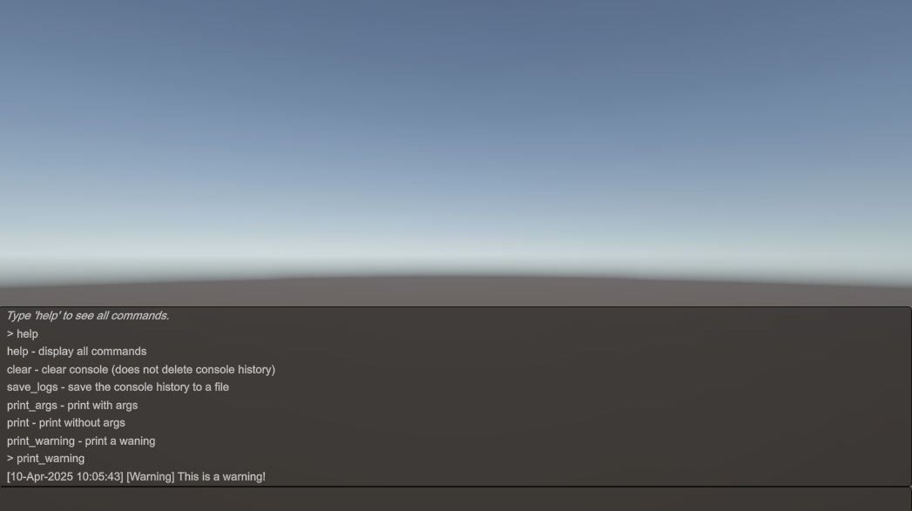
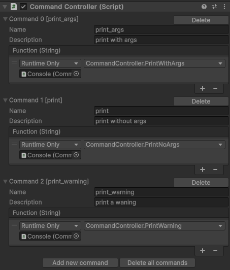

# Command-Console
Unity console that allows the user to input commands for debugging purposes. It can be also used as a "cheat" console.

<figure>
  
</figure>

This project uses Unity's IMGUI feature to display the console. When the scene is running, the console can be displayed by pressing the `` ` `` key. Clicking it again will hide the console.

The main logic lies in the ``CommandController`` script. It defines a set of default commands (``help``, ``clear``, ``save_logs``), and allows creating new commands through the ``CommandDetails`` struct. This is shown in the Inspector, where each command requires a name (which is the text to be inputted in the console to perform the command's event), a description, and an UnityEvent. The event needs to exist in a script that is attached to a GameObject, otherwise it will not be visible in the Inspector.

- ``help`` - displays all commands, including the default ones set in the script and the ones created in the Inspector.
- ``clear`` - clears the console without deleting its history.
- ``save_logs`` - saves the console history to a file; any text after the command will be parsed as the filename, but if none is given, the new file will use the default "output" name.

There is a custom editor for the main script, called ``CommandEditor`` which displays the list of existing commands, along with buttons to create or delete commands.

<p align="center">
  
</p>

The ``Command`` script defines a base class and two derived classes. ``Command`` is used for methods that have no arguments, while methods that require arguments will use ``Command<T>`` instances. Currently, the only parameter type processed by the main class is ``string``. This implies further processing inside each invoked method.

The ``SubscribeToUnityLogs`` script ensures that any messages received from Unity (warnings, errors, general log information) are shown in the console. They are displayed in the following format: ``dd-MMM-yyyy HH:mm:ss [log type] [log message]``. A stack trace is also provided if the log type is error.

## Getting started
Clone the repository:

```git clone https://github.com/lavinia-lehaci/Command-Console.git```

Run the project:
- Open the Unity project and the sample scene. The ``Console`` GameObject has the necessary scripts attached to it.
    - Alternatively, create an empty Game Object and attach the ``CommandController`` script to it. That will also allow the custom editor to be displayed.
    - If you want to receive log messages from Unity, attach also the ``SubscribeToUnityLogs`` script. 
- Add your own custom commands in the Inspector.
- Click Play to run the scene. Type `` ` `` to display the console and input any of the set commands.

## References
[This video](https://www.youtube.com/watch?v=VzOEM-4A2OM) from Game Dev Guide served as inspiration in the early stages.

## License
This project is licensed under the MIT License - see the [LICENSE](LICENSE) file for details.