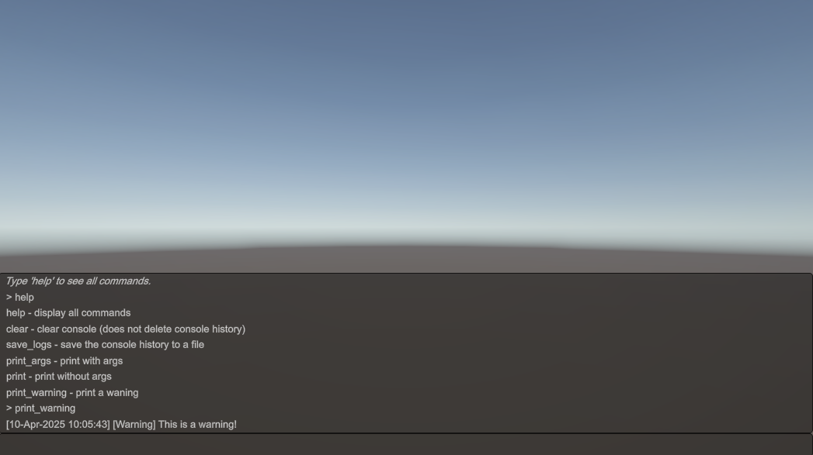
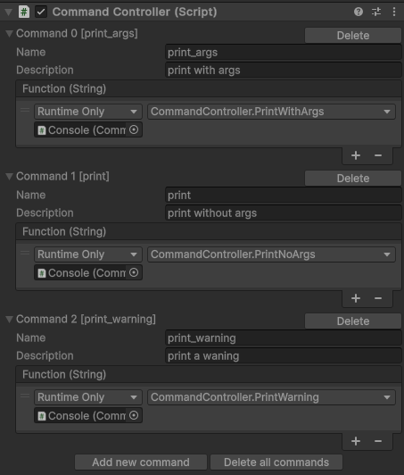

# Command-Console
A runtime command console for Unity, built with IMGUI, useful for debugging or as an in-game "cheat console".

<figure>
  
</figure>

## Features

- Toggleable runtime console (`` ` `` key) built with Unity's IMGUI
- Default commands: `help`, `clear`, `save_logs`
- Custom commands configurable entirely from the Inspector
- Custom Inspector editor for adding/removing commands
- Captures Unity's own log messages (warnings, errors, info) directly into the console, with stack traces on errors

## Getting started
**Requirements:** Unity 6, URP

1. Clone the repository: 
```git clone https://github.com/lavinia-lehaci/Command-Console.git```

2. Open the project and load the sample scene. The `Console` GameObject already has the required scripts attached.
   - Or, in your own scene: create an empty GameObject and attach the `CommandController` script (this also enables the custom Inspector editor). Attach `SubscribeToUnityLogs` too if you want Unity's own log messages to appear in the console.
3. Press Play, then `` ` `` to open the console and try a command (e.g. `help`).
 
## Default commands

| Command | Description |
|---|---|
| `help` | Lists all available commands, both built-in and ones defined in the Inspector |
| `clear` | Clears the visible console, without affecting its history |
| `save_logs` | Saves the console history to a file under `Assets/Log`. Any text after the command is used as the filename; defaults to `output` if none is given |

## Adding custom commands

<table>
<tr>
<td width="50%">

New commands are added from the Inspector via a `CommandDetails` struct, with no need to modify the console's code directly.

Each command needs:
- **Name** — the text typed in the console to trigger it
- **Description** — to be shown when `help` is called
- **Event** — a `UnityEvent`, which must point to a method on a script already attached to a GameObject in the scene (events not attached to the scene won't appear as assignable)

A custom Inspector editor (`CommandEditor`) lists existing commands and provides buttons to add or remove them.

</td>
<td width="50%">

  

</td>
</tr>
</table>

## Known limitations

The console only parses `string` arguments; any command needing another type (numbers, bools, etc.) has to convert and validate the string itself inside the invoked method.

## How it works

The core logic lives in the `CommandController` script, which defines the default commands (`help`, `clear`, `save_logs`) and exposes custom commands through the `CommandDetails` struct shown in the Inspector.

The `Command` script defines a base class for commands with no arguments, and a generic `Command<T>` for commands that take one. Currently `T` is only used as `string`, so any further parsing (to a number, bool, etc.) happens inside the invoked method itself.

`SubscribeToUnityLogs` hooks into Unity's own logging system, so any warning, error, or info message Unity produces is also shown in the console, formatted as `dd-MMM-yyyy HH:mm:ss [log type] [log message]`, with a stack trace attached for errors.

## What I'd add next

- Typed command arguments (numbers, booleans, etc.) instead of leaving all parsing to each command
- Command history and autocomplete, e.g. pressing up-arrow to recall the last command

## References

- [Creating a Cheat Console in Unity by Game Dev Guide](https://www.youtube.com/watch?v=VzOEM-4A2OM), used as early inspiration

## License
This project is licensed under the MIT License - see the [LICENSE](LICENSE) file for details.
